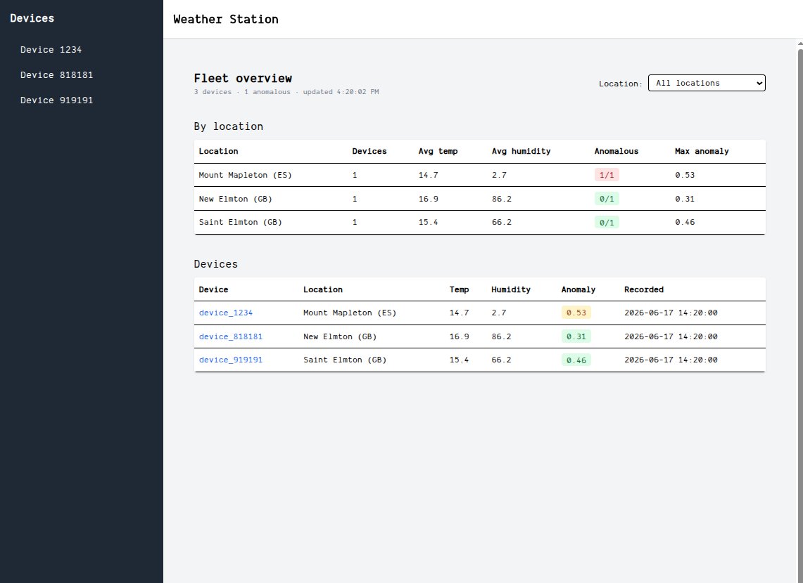
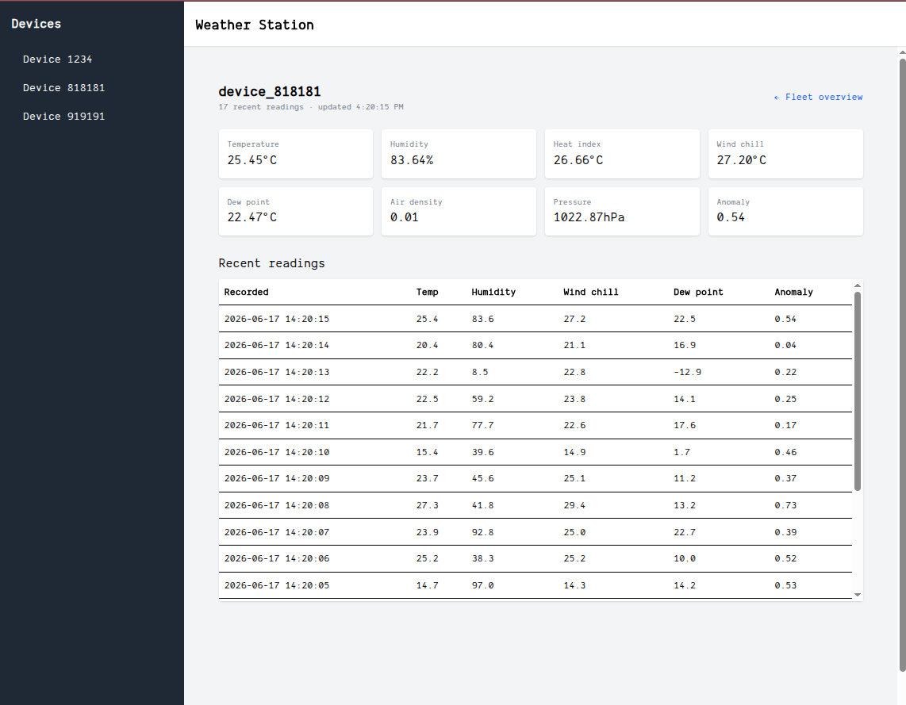

# Weather Station — Take-Home

## The story

A field of weather sensors is out there right now, each one phoning home every few seconds with temperature, humidity, pressure and wind. A few weeks ago someone wired up a **spike** — a quick proof-of-concept — to get the data flowing into a dashboard for a demo. It worked. The demo went well. So now it's real: more devices are coming online, people want to watch the fleet live, and the thing that was *good enough for a demo* has to become something you'd actually run in production.

That spike is what you've inherited. **Your job is to take it to production.** It already ingests, computes a few metrics, stores to ClickHouse, and has a placeholder UI — but it was written fast, and it shows. Where it bends and breaks under real device load, and what you do about it, is the heart of this exercise.

## How we evaluate (please read)

Use whatever AI tooling you'd use on the job — we assume you do. We **don't score keystrokes**; we score the **decisions** you make, how you direct your tools, and your ability to **explain and defend** the result. The formulas and the basic UI are the easy part. What we're looking for is the engineering judgment in turning rough prototype code into something production-ready: what you noticed, what you chose to fix, what you deliberately left alone, and why.

So: read the spike before you change it. Run it. Watch how it behaves. Then make it yours.

> **Server language:** you may productionize the spike (Node) or rewrite the ingestion service in the language of your choice. `nodejs`, `php`, or `java` are a plus.

---

## 1. Data ingestion service

A service receives sensor data over HTTP on port `3030` (`POST /ingest`). Each payload carries:

- **device_id** — String (ID of the device)
- **temperature** — Float
- **humidity** — Float (percentage)
- **pressure** — Float
- **wind_speed** — Float
- **location** — String (where the sensor is)
- **timestamp** — Integer (when the reading was taken)

For every reading the service must:

1. **Compute metrics** — heat index, air density, wind chill, dew point (formulas in §4).
2. **Detect anomalies** — an anomaly probability from the temperature (algorithm in §4).
3. **Persist** the reading, the computed metrics, and the anomaly score to the database.

The spike does all of this already — for a demo. How it holds up when real devices are streaming at it is the part that matters.

---

## 2. The data (schema provided)

The table is already provisioned. It stores:

| Field | Type | Notes |
|---|---|---|
| `device_id` | String | device ID |
| `temperature` | Float | |
| `humidity` | Float | percentage |
| `pressure` | Float | |
| `wind_speed` | Float | |
| `heat_index` | Float | computed |
| `air_density` | Float | computed |
| `wind_chill` | Float | computed |
| `dew_point` | Float | computed |
| `location` | String | where the sensor is |
| `recorded_at` | Timestamp | when the reading was taken |
| `anomaly_prob` | Float `[0,1]` | how anomalous the reading is (§4) |
| `signature` | String | per-reading integrity signature (already computed by the service) |
| `attestation` | String | the device's per-reading attestation certificate — a compliance/audit artifact, retained as received |

The exact definition is in [`init.sql`](./server/clickhouse/init/init.sql) — that's the schema you read and write against.

> **ClickHouse is owned and operated by the data-platform team and is out of scope for this exercise.** Treat the schema as a fixed external contract: don't modify `init.sql`, the table definition or its sort/index keys, and don't add materialized views. Build against it as it is. (It's already wired into docker-compose — no setup needed.)

---

## 3. The console (frontend)

Build a **real-time console for the whole device fleet**. Concretely:

- A **fleet view** showing every device at once with its latest reading, updating live (today it's a placeholder).
- A **per-device detail view** (its recent readings), reachable from the sidebar.
- **Live per-location summaries** — average temperature/humidity and an anomaly overview per location, updating alongside the fleet.
- A way to **filter the fleet by location** — operators need to focus, and the view should stay smooth while they do.
- It must **stay responsive and correct as the fleet grows and as devices misbehave** — devices go quiet, report late or out of order, and the data source isn't always healthy. Assume many people are watching at once.
- **Near-real-time** (at least every 10s), and surface the anomaly information in a way that's actually *useful*.

A read endpoint already exists (it serves a single device); the rest of the read API is yours to design — **shape it so each view gets what it needs efficiently.** The React app is set up in [`client`](./client/).

The screens below are a **reference for the kind of console we're after** — not a pixel spec. How you lay it out, structure it, and keep it fast is your call.

**Fleet view** — live fleet, per-location rollups, location filter, anomalies surfaced:



**Per-device detail** — latest metrics and recent readings:



---

## 4. Algorithms

1. **Anomaly detection**
```
expected = 20   # expected baseline temperature

function detectAnomaly(temperature):
    return min(1, abs(temperature - expected) / 10)
```
2. **Dew point**
```
function calculateDewPoint(temperature, humidity):
    a = 17.27
    b = 237.7
    alpha = ((a * temperature) / (b + temperature)) + log(humidity / 100)
    return (b * alpha) / (a - alpha)
```
3. **Air density**
```
function calculateAirDensity(pressure, temperature):
    return pressure / (287.05 * (temperature + 273.15))
```
4. **Wind chill**
```
function calculateWindChill(temperature, windSpeed):
    if windSpeed > 4.8:
        return 13.12 + 0.6215 * temperature - 11.37 * windSpeed^0.16 + 0.3965 * temperature * windSpeed^0.16
    else:
        return temperature
```
5. **Heat index** (NWS Rothfusz regression — note: defined in °F)
```
function calculateHeatIndex(temperatureC, humidity):
    T = temperatureC * 9/5 + 32          # °C -> °F
    R = humidity                          # relative humidity, %
    HI =  -42.379
        +  2.04901523   * T
        + 10.14333127   * R
        -  0.22475541   * T * R
        -  6.83783e-3   * T^2
        -  5.481717e-2  * R^2
        +  1.22874e-3   * T^2 * R
        +  8.5282e-4    * T * R^2
        -  1.99e-6      * T^2 * R^2
    return (HI - 32) * 5/9                 # °F -> °C
```

---

## 5. Deliverables

- **Working code** — productionized ingestion service, the read API, and the console.
- **`DECISIONS.md`** — what you changed and why, the trade-offs you made, and what you'd do with more time. This is where you make your reasoning visible; we read it first.
- *(Optional, encouraged)* the key prompts or an AI session you're proud of — we're interested in how you direct your tools. Never required, never penalized.

---

## 6. Running it

Everything is provided via docker-compose: a data-generation service (mimics real devices streaming live), ClickHouse, and the React starter.

```sh
# everything
docker compose up

# or individual services
docker compose up clickhouse
docker compose up device
docker compose up react-app
```

You can also run the client directly:

```sh
cd client && npm install && npm run dev
```

The device service streams fake data to `http://sensor-ingestion:3030/ingest` (`sensor-ingestion` is the service host on `app_network`). The default load is gentle — **bump `DEVICE_COUNT` (and lower `INTERVAL_MS`) on the device service to simulate production volume**, e.g. `DEVICE_COUNT=50 docker compose up`. Point the device's `TARGET_URL` in [`docker-compose.yml`](./docker-compose.yml) at your own ingestion service if you split it out.

---

## What we're looking for

1. **Decoupling for high demand** — does it hold up when the devices really come?
2. A console that stays **correct, live, and responsive** as the fleet grows and misbehaves.
3. Sound engineering **judgment and trade-offs**, clearly explained.

Server language is your call — `nodejs`, `php`, or `java` are a plus.

